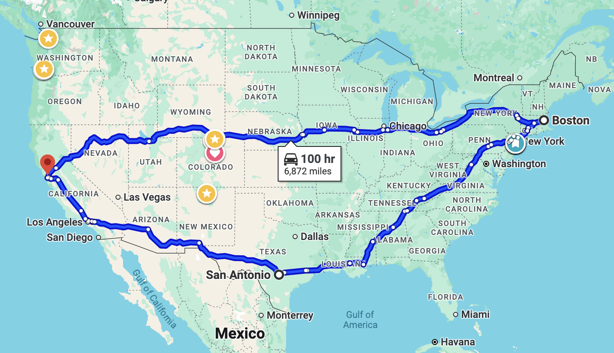

# AI Tooling for Software Product Design and Development

**Instructor: Dr. Gabe Johnson**

This repository houses course materials for an AI tooling support course at
CU-Boulder, Fall 2025. There are various course numbers:

- ATLS 4519 (for CTD undergrads)
- ATLS 5519 (for masters students in Atlas)
- CSCI 4830 (for computer science undergrads)

## Aliens Have Landed

Sometime in the past year, large language models (LLMs) have entered the
community's consciousness. This seemed like a gradual event: your nerdier
friends might have been talking about ChatGPT in 2022, and somewhere between
then and now, everybody who stands to gain (not to mention go out of business)
has taken note. In some companies, using AI is now a job requirement.

We're still trying to understand what this means. I don't mean to be hyperbolic,
but it is as though aliens have landed, and we're trying to figure out what this
means for life in a changed world.

We've always invented machines (the mechanical type) to help us toil away to
till fields, stamp widgets, make useless plastic junk. There was a clear
separation between physical chores and intellectual tasks. But now here comes
AI, and it can do the thinking for us as well. Where does that leave us?

Well, it depends on what AI really can do and what the tradeoffs are. This is a
fundamentally new thing, and it is evolving so quickly that it is not possible
to stay on top of current events.

To abuse the "aliens have landed" metaphor: What do they want? What can they do
for us today? What can we learn from them? What dangers do they pose? What are
their limitations? What are the environmental impacts?

How will _we_ change as a result? Machines that can truly think, design, and
create have already begun to change our culture and economics. Understanding
tricky concepts used to involve practices like reading books, taking college
classes, consulting experts, and challenging yourself to apply the concepts
until they make sense. AI gives us alternatives. Perhaps we won't need to study
as deeply, or take advanced courses, engage with experts, or even apply the
concepts ourselves. Where does that leave us?

## Course Goals and Non-Goals

- **Goal:** To calibrate ourselves to think, work, live in an AI world
- **Non-Goal:** To use a bunch of AI tools

Just as you can not calibrate an instrument without references and measurements,
we can not calibrate ourselves without the same. In this course, we will embark
on wild adventures with AI tools on a number of topics related to digital
products: ideation, collaboration, screen design, user experience, software
prototyping, engineering, product life cycle management, marketing, and so on.
So while we might _use_ Replit to vibe code a new app, Suno to produce a song,
or the little sparkly icon in literally any modern app to do whatever, I want to
be clear that _learning specific tools is not the point of the class_.

The reason for this is that you can not generalize without a reasonable sample
size, so we will need to see what is out there. This changes by the moment.

- **Goal:** To understand the broad strokes of how AI does and doesn't work
- **Non-Goal:** To build/train/use a large language model

This second goal/non-goal pair is about understanding the underlying technology
itself. You don't need to be an automotive engineer to drive a car, you should
still understand what a car can and can't do. To use AI effectively, you _will_
need to understand something about how it works, but you _won't_ need to be able
to build your own LLM from scratch.

LLMs are not magic. They actually operate on fairly simple principles. We will
cover this superficially in order to demystify their functioning, and to help
understand how we can use them.

## Tool Topics

AI is blurring the boundaries between traditional skills. Practitioners are able
to (and are often _expected_ to) work outside of their core areas. You will be
expected to work outside of your comfort zone. For example, if you're a computer
science major, you might learn to use Figma (with and without AI) to design
screens and flows that you will then implement (with or without AI).

Our focus here will be broad. We will include AI technologies that are used to
produce software. Including various traditional roles, from planning, design,
engineering, marketing, maintenance and support.

None of us (myself included) have expertise in all of these areas. There are AI
systems that (for money) will help you out:

- Research: Perplexity, Claude, ChatGPT - Transform literature reviews and
  market research from days of manual searching to interactive conversations
  that synthesize sources
- Planning: Notion AI, Linear AI - Turn vague project ideas into structured
  roadmaps and break down complex features into actionable tasks
- UX Design: Figma AI, Uizard, v0 - Generate wireframes from text descriptions
  and create design systems that previously required extensive design expertise
- Media: Midjourney, DALL-E, Suno, ElevenLabs - Enable non-artists to create
  professional-quality visuals, audio, and video content for prototypes and
  marketing
- System Architecture: Claude, Cursor, GitHub Copilot - Help developers design
  scalable systems and generate boilerplate code, reducing the barrier to
  building complex applications
- Software Engineering: GitHub Copilot, Cursor, Replit AI - Autocomplete entire
  functions and debug issues in real-time, dramatically speeding development
  cycles
- Automated Testing: GitHub Copilot, TestPilot - Generate comprehensive test
  suites from natural language descriptions of expected behavior
- Debugging: Claude, Cursor - Analyze error logs and suggest fixes, turning
  hours of investigation into minutes of conversation
- Collaboration: Slack AI, Notion AI - Summarize long threads and generate
  meeting notes, helping teams stay aligned without constant manual coordination

## Social and Environmental Topics

People have justified apprehensions around AI. Starting a web search for "AI
causes..." gives the following suggested completions:

- "ai causes laziness"
- "ai causes unemployment"
- "ai causes brain damage"
- "ai causes cheating"
- "ai causes job loss"
- "ai causes loneliness"
- "ai causes property damage"
- "ai causes mass unemployment"

Auto-suggest completions are based on what people search for. This is obviously
not a scientific study, but it captures the zeitgeist. People are afraid of what
AI is going to do _to them_, and not in a friendly way.

AI takes an astounding amount of electricity, and boils a lot of water to cool
the computers. See
[here](https://miljamoss.neocities.org/Articles/LLMWaterAndEnergyUse),
[here](https://arxiv.org/pdf/2304.03271),
[here](https://arxiv.org/html/2505.09598v2). Obviously resource usage varies
based on location, weather, data center and hardware design, and model
efficiency. But for our purposes we can do some napkin math to roughly estimate
water and energy usage. According to
[ccusage](https://github.com/ryoppippi/ccusage) my personal Claude Code usage
for a 1-month period this summer was 252 million tokens. (I'll talk about tokens
in a bit!)

To make that more visceral, let's do some napkin math to convert that to water
and energy usage. Per 1M tokens, we can drive a Tesla EV 27 miles, and it takes
17 liters of water to cool. So my month of random vibe coding works out to:

```
252 M tokens
    = 6804 miles (road trip from San Francisco to Boston to San Antonio to SF)
    = 4284 liters (about 20 bathtubs)
```




## Crystal Balls

### Cal Newport on Podcast "Plain English with Derek Thompson"

https://podcast.app/will-ai-usher-in-the-end-of-deep-thinking-e421556857

What actually do we _want_ to get out of AI? Culturally, economically? Educationally? In what ways does AI make us better? How is it making us intellectually lazy? Does reliance on AI reduce our ability to think, create, craft?

Assuming we want to retain some/most/all elements of education that has been built over the past 300 years, what should we do? Make education more of a performance, requiring students to "defend" their perspectives, their facts, their arguments. "A question well asked is half-answered." - AI does not critique your line of questioning, but it is good at answering whatever you ask. They use the term "parasocial" in reference to how humans interact with AI, when the AI has a human-like conversational quality.

How does the mere presence of "expert authority" affect our comfort with making assertions on topics that we are not good at? E.g. Aristotle was a polymath, in context of a society in which there was not expertise. So it was easier to break new ground because the ground was unbroken. The podcast makes the argument that Hellenistic thinking was possible because the culture of the era promoted thinking hard. I think there was also a cultural, social element to this as well.

The article that Nikolaus had for suggested reading last semester argued that AI in the hands of a novice would not let the novice perform at the level of a human expert, but an expert with AI could use it to improve overall outcomes. Good judgement, critical thinking, and skepticism is required.

### Inside the AI Hype Cycle, and how AI is Making Music

Two pieces on the present and future of business and work in context of AI. They have an interesting contrast.

https://podcasts.apple.com/us/podcast/inside-the-artificial-intelligence-hype-cycle-and-how/id73330715?i=1000716850910

First bit is an interview with Ed Zitron ("a one man army of aggression against Sam Altman") who is hardly unbiased.

Second bit is a personal story from a musician who contemplates the future of his job, profession, and passion in context of generative AI.
